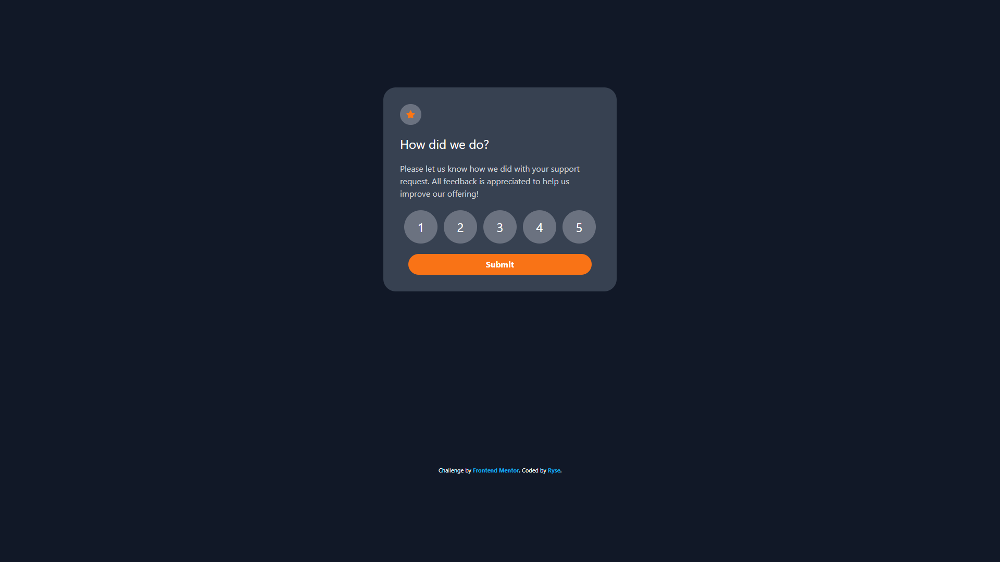

# Frontend Mentor - Interactive rating component solution

This is a solution to the [Interactive rating component challenge on Frontend Mentor](https://www.frontendmentor.io/challenges/interactive-rating-component-koxpeBUmI). Frontend Mentor challenges help you improve your coding skills by building realistic projects.

## Table of contents

- [Overview](#overview)
  - [The challenge](#the-challenge)
  - [Screenshot](#screenshot)
  - [Links](#links)
  - [Built with](#built-with)
  - [What I learned](#what-i-learned)
  - [Continued development](#continued-development)
  - [Useful resources](#useful-resources)
  - [Author](#author)

## Overview

### The challenge

Users should be able to:

- View the optimal layout for the app depending on their device's screen size
- See hover states for all interactive elements on the page
- Select and submit a number rating
- See the "Thank you" card state after submitting a rating

### Screenshot

### Links

- Solution URL: [Add solution URL here](https://your-solution-url.com)
- Live Site URL: [Add live site URL here](https://your-live-site-url.com)

### Built with

- Semantic HTML5 markup
- CSS custom properties
- Flexbox
- CSS Grid
- TailwindCSS

### What I learned

This is my first (submitted) FrontendMentor project. I've done a couple and haven't uploaded them but this is my first Javascript project and I learned a lot.

I've only been learning JS for a about a week and I think I can get the grasp of it eventually.

Seeing with how JS and Tailwind interact with eachother is interesting.

### Continued development

I want to get better at frontend learning in all remarks. I have the understanding of HTML and CSS, but JS will take a bit.

### Useful resources

HTML/CSS - (https://www.youtube.com/@kevinpowell) Kevin is a great teacher for HTML/CSS. Everything I've learned so far is from him. He expains things great in an easy and in-depth way.

JS # 1 (https://developer.mozilla.org/en-US/docs/Web/JavaScript)
This was my first resorce for learning JS. It's pretty good, easy to learn but don't seem to get updated.

JS # 2 - (https://learnjavascript.online/) This is what I've been using for the last couple days and I've already learned as much from it as I have with MDN learning docs. It seems more up to date as well. I really like it. Still in the free chapters.

## Author

- Frontend Mentor - [@yourusername](https://www.frontendmentor.io/profile/Frostkain)
